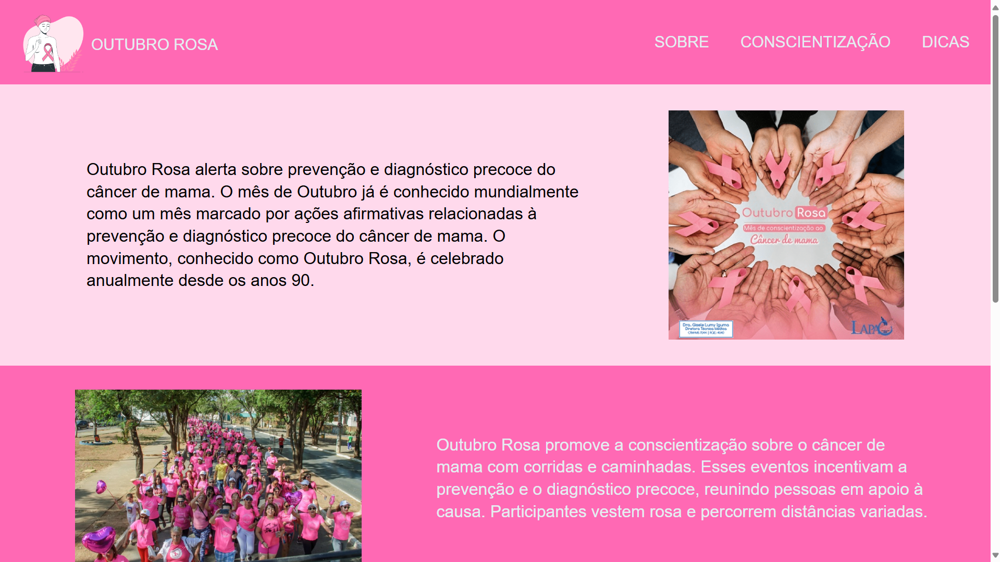

# Outubro Rosa

> Status : Finished project ✅ / Open PR

## VaiNaWEb Challenge [01]

*Technologies*

+ Html5 
+ Css3 
+ SASS 🎨

### How to use
 
 - git clone https://github.com/12Gustavo21/outubro-rosa or download the zip
 - code . (if you use VSCode)
 - start a Live Server
 
 ## 💻 Online Page: https://outubro-rosa-vainaweb.vercel.app

## 🌐 Contact me:
 
